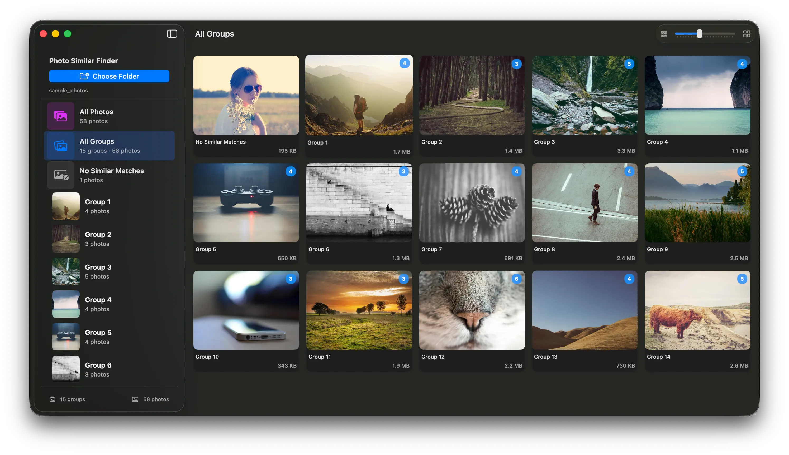

# Photo Similar Finder

แอปพลิเคชัน macOS สำหรับจัดกลุ่มรูปภาพที่คล้ายกันหรือ burst shot จากกล้องถ่ายรูป เพื่อให้เลือกลบรูปที่ไม่ต้องการได้ง่ายและประหยัดพื้นที่

> 🇬🇧 [English](README.md)




---

## คุณสมบัติ

### การจัดกลุ่มรูปภาพ
- **ชื่อไฟล์เดียวกัน** — ไฟล์ที่มีชื่อไฟล์เหมือนกัน (เช่น `IMG_0001.JPG` + `IMG_0001.CR3`) รวมเป็น shot เดียวกัน
- **Visual Similarity (Neural Engine)** — วิเคราะห์ความคล้ายคลึงทางภาพด้วย AI ผ่าน Vision framework จัดกลุ่มรูปที่ดูคล้ายกันแม้ชื่อไฟล์ต่างกัน

### ฟอร์แมตที่รองรับ

| ประเภท | นามสกุล |
|--------|---------|
| JPEG | `.jpg`, `.jpeg` |
| Modern | `.heic`, `.heif`, `.webp` |
| Other | `.png`, `.tiff`, `.tif`, `.bmp`, `.gif` |
| Canon RAW | `.cr2`, `.cr3` |
| Nikon RAW | `.nef`, `.nrw` |
| Sony RAW | `.arw`, `.srf`, `.sr2` |
| Adobe DNG | `.dng` |
| Fujifilm | `.raf` |
| Olympus/OM | `.orf` |
| Panasonic | `.rw2`, `.rwl` |
| Pentax | `.pef`, `.ptx` |
| Phase One | `.iiq`, `.cap` |
| Others | `.3fr`, `.fff`, `.erf`, `.mef`, `.mos`, `.mrw`, `.rwz`, `.x3f`, `.srw` |

### Hardware Acceleration (Apple Silicon)

| ชิป | Framework | หน้าที่ |
|-----|-----------|--------|
| **Media Engine** | `QuickLookThumbnailing` | Decode thumbnail ทุกฟอร์แมต (รวม RAW) |
| **GPU — Metal** | `CoreImage` + `Metal` | Render รูปเต็มผ่าน Metal pipeline |
| **Neural Engine** | `Vision` | คำนวณ feature print เพื่อวัดความคล้ายคลึง |

### UI และ Keyboard Shortcuts

| ปุ่ม | หน้าที่ |
|------|--------|
| `←` / `→` | เลื่อนดูรูปภาพภายในกลุ่ม |
| `↑` / `↓` | ไปกลุ่มก่อนหน้า / ถัดไป |
| `D` | Toggle เลือก/ยกเลิกเลือกรูปที่จะลบ |
| `Esc` | ปิด preview |

- คลิกการ์ดรูปเพื่อเปิด preview แบบเต็มจอ
- Film strip ด้านล่างแสดงทุกไฟล์ในกลุ่ม คลิกเพื่อเปิดรูปนั้น
- รูปที่เลือกลบจะมีไอคอน 🗑 และ border สีแดง
- ลบโดยกดปุ่ม "Delete N photo(s)" — ย้ายไปถังขยะ (สามารถกู้คืนได้)

---

## ความต้องการของระบบ

- **macOS 14 Sonoma** หรือใหม่กว่า
- **Apple Silicon** (M1 / M2 / M3 / M4 หรือใหม่กว่า)
- Swift 5.9+ / Xcode 15+ หรือ Command Line Tools

---

## การติดตั้งและ Build

### Clone

```bash
git clone <repo-url>
cd photo-similar-finder-mac/PhotoSimilarFinder
```

### Build (Swift Package Manager)

```bash
# Debug build
./build.sh

# Release build
./build.sh release
```

### Build และ Run ในคำสั่งเดียว

```bash
./run.sh
```

### Build ผ่าน Xcode

```bash
open PhotoSimilarFinder.xcodeproj
```

จากนั้นกด `⌘R` เพื่อ build และ run

> **หมายเหตุ:** ครั้งแรกที่ run อาจต้องตั้งค่า Development Team ใน Xcode  
> (Signing & Capabilities → Team) สำหรับ hardened runtime

---

## โครงสร้างโปรเจกต์

```
PhotoSimilarFinder/
├── Package.swift                    # Swift Package Manager config
├── build.sh                         # Script: build เท่านั้น
├── run.sh                           # Script: build + run
├── PhotoSimilarFinder.xcodeproj/    # Xcode project
└── PhotoSimilarFinder/
    ├── PhotoSimilarFinderApp.swift  # App entry point (@main)
    ├── ContentView.swift            # Root UI: NavigationSplitView + sidebar
    ├── GroupGridView.swift          # Grid ของกลุ่มรูปภาพ (LazyVGrid)
    ├── PreviewView.swift            # Full preview + film strip
    ├── Models.swift                 # ImageFile, ImageGroup, ImageScanner
    ├── AppState.swift               # @MainActor ObservableObject: state ทั้งหมด
    ├── ImageProcessor.swift         # Hardware-accelerated: Metal / QL / Vision
    ├── Info.plist
    └── PhotoSimilarFinder.entitlements
```

### Architecture

```
AppState (ObservableObject, @MainActor)
    │
    ├─ scanWithVision() ──► ImageScanner
    │                         ├─ makeStemShots()            # รวม JPG+RAW pairs → 1 shot
    │                         ├─ computeFeaturePrint()      # Vision Neural Engine (concurrent)
    │                         └─ clusterShotsBySimilarity() # O(n²) pairwise cosine + Union-Find
    │
    ├─ UI ──► ContentView
    │             ├─ SidebarView         (folder picker, stats, delete button)
    │             ├─ GroupGridView       (LazyVGrid ของ GroupCardView)
    │             └─ PreviewView (sheet) (full image + FilmStripView)
    │
    └─ Image Loading ──► ImageProcessor
                             ├─ loadThumbnail()       → QLThumbnailGenerator (Media Engine)
                             ├─ loadFullImage()       → CIImage → Metal GPU
                             └─ computeFeaturePrint() → Vision (Neural Engine)
```

---

## การปรับแต่ง

### ปรับ threshold ในการจัดกลุ่ม

แก้ไขใน [Models.swift](PhotoSimilarFinder/Models.swift):

```swift
// Vision similarity: cosine similarity ค่า 0.0–1.0 (default: 0.92)
// สูง = ต้องคล้ายกันมากจึงจะจัดกลุ่มรวม
static let visionSimilarityThreshold: Float = 0.92
```

---

## License

MIT
